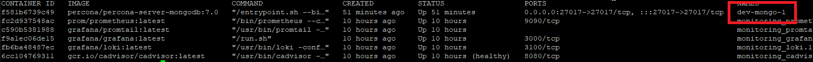

# Docker single node deployment

## Prerequisites

- A node with [these](https://confluence.dedalus.com/display/IAT/Docker+deployment+-+component+requirements) prerequisites
- A user with the authorization of running docker: we will call it dedalus_docker
- A user to log into the node
- A software to connect to a Linux console (the console itself can be good, under windows you can use [PuTTy client](https://www.putty.org/))
- A software to transfer files: the console con be good or [WinSCP](https://winscp.net/eng/download.php)
- the ssh key that usually is needed to connect to the node (otherwise can be only username and password, depends on the environment)

## Switch to dedalus docker user
To run the docker instructions you need to become the "dedalus_docker" user

```bash
su dedalus_docker
```
Then type the password

## AWS Credentials registration and use
Before pulling the Dedalus images from the repositories it's necessary to register the credentials

The credentials can be found [here](https://confluence.dedalus.com/display/IAT/IVD+Services+-+deployment+info)

- Log into the node and [switch to deadlus_docker user](#switch_to_dedalus_docker_user)
- type 
```bash
aws configure
```
- The interface will ask for
1. AWS Access Key ID = 
2. AWS Secret Access Key =
3. Default region name = eu-west-1
4. Default output format = json

- Check if correctly set by typing
```bash
aws sts get-caller-identity
```

### AWS Login
Before pulling a new image it's necessary to log in 

```bash
aws ecr get-login-password --region eu-west-1 | docker login --username AWS --password-stdin 350801433917.dkr.ecr.eu-west-1.amazonaws.com
```

## Deployment structure

### dedalus folder
The dedalus folder is placed at:
/opt/dedalus/docker/

### workspace

The workspace where we will put our bundles is

/opt/dedalus/docker/bundles

### main folders
Each service will release its own package that will be, in the and, a directory to put under the directly "bundles"
Each service will release a "bundle" [following this structure](https://confluence.dedalus.com/display/IAT/Docker+deployment+-+component+requirements)

example:<br>
/opt/dedalus/docker/bundles/ds<br>
/opt/dedalus/docker/bundles/device_manager

<b>env</b> folder
The  "global-env" bundle will containes shared common variable values
- /opt/dedalus/docker/bundles/global-env/environments/stage/env/shared.env
- /opt/dedalus/docker/bundles/global-env/environments/stage/env/routes.env
- /opt/dedalus/docker/bundles/global-env/environments/stage/env/proxy-map

### services folders
Each service needs to produce a release compose of these folders
- compose file: a file named "compose-docker.yaml" that contains the definition of the service
- scripts: where there are utily scripts
- environments folder: in here there is everything will be splitted by environment
- by default each service will release the "environments/stage" directory as default
- under every environment directory there will be other dicretories:
- env: where to keep the variables file
- config: for the configuration files, it's reserved for the files that the application may need to read
- data: where the application can write
- secrets: to keep the secrets

Example:<br>
ivdservice_AAA/<br>
├── docker-compose.yaml<br>
├── environments<br>
│   ├── prod<br>
│   └── stage<br>
│       ├── conf<br>
│       │   ├── conf-file-AAA-1.xml<br>
│       │   └── conf-file-AAA-2.xml<br>
│       ├── data<br>
│       ├── env<br>
│       │   ├── compose.env<br>
│       │   └── services.env<br>
│       └── secrets<br>
└── scripts<br>


## Workspace folder setup

- [switch to dedalus_docker user](#switch_to_dedalus_docker_user) user and create the same workspace into the docker space
```bash
mkdir  /opt/dedalus/docker/bundles
```


## Configuration upload

For all the following examples I will assume
- The node user that can connect to the node is: <b>ec2-user</b>
- The docker user that can operate on docker is : <b>dedalus_docker</b>
- The environemnt we are using is : <b>stage</b>

The target of this part of the documentation is to bring the "bundles" folder with alle the bundles in it into the folder /opt/dedalus/docker/bundles.
Of course you can do it in many ways, download it directly into the node for example.
In this guide we assume a more "common" approach based on the fact that many persons like to edit files in a classic PC environment

NB: it you are using windows, use an editor that keeps the Unix EOL, not the windows one!!

0. If you want to start from an extarnal machine, create a folder like customer/bundles somewhere

1. Prepare your deployment on the workstation you are using: that means that you have to put the files under a folder that is called "bundles"
It has to look like the folder structure you see [here](https://confluence.dedalus.com/display/IAT/Docker+deployment+-+component+requirements#Dockerdeploymentcomponentrequirements-Deploymentstructure)

2. Download the [bundle-ivd.zip](https://github.com/dedalus-ivd/ivd-ais-docker-solution/releases) that will contain the network, mongo, haproxy, monitoring and the env folder. Unzip it into your pc and then copy the content inside the bundles folder you prepared for the deployment.
You will have: <br>
bundles/<br>
├── device_manager<br>
├── ds<br>
├── global-env<br>
├── haproxy<br>
├── mongo<br>
├── monitoring<br>
└── network<br>

3. Download release zip file for each service product you are going to deploy and put it into the bundles folder (r4c, ds, ld....)

4. Configure global-env/environments/stage/env/shared.env (this goes for "stage" environment) file variables:
- Set the AIS_WORKSPACE using the correct one (file global-env/environments/stage/env/shared.env) the value is stage, for stage, prod for prod...etc
- Set the SOLUTION_BASE_URL using the solution one (file global-env/environments/stage/env/routes.env): this should be the base url in front of the solution, not the node one (even thought they can be the same) but if, for example, there is a load balancer in front of two nodes, you need to use the address of the load balancer

5. configure each product: in this guide we will cover the mongo (only for stage purposes), the haproxy, the monitoring and we take the discovery service and device manager as example so configure them before uploading the files

6. Upload your folder into the node. It should land in the upload folder /opt/dedalus/upload, in this case:
So you will end up having the configuration under the folder /opt/dedalus/upload/bundles 

9. Log into the node using an ssh like tool (like PuTTy or directly using the shell)

10. [switch to dedalus_docker user](#switch_to_dedalus_docker_user) (you will be asked for a password if any)
```bash
su dedalus_docker
```

11. Copy the configuration <br>

```bash
cp -r /opt/dedalus/upload/bundles /opt/dedalus/docker/
```

NB: in this first step we copy all the directory from the upload to the workspace directory. Later you will do probably some ittle modification.
You can choose the approach you like to bring the files into the workspace folder(opt/dedalus/docker/bundles)<br>
Our suggestions is to copy "only what is change" and to follow "always" the same copy direction:<br>
Local folder -> upload folder -> workspace folder <br>
You can work directly into the upload folder and go <br>
upload folder ->workspace folder
But we suggest to keep the upload folder updated so that if another user has to synchronize to the last modification he can do it

11. Go the bundles folder 

```bash
cd  /opt/dedalus/docker/bundles
```

## Network creation
As first you need to create a subnetwork
1. Upload the configuration
2. Connect to the node and become the docker user
3. Go to in the network folder 
```bash
cd /opt/dedalus/docker/bundles/network
```

```bash
bash scripts/compose.sh stage create
```
4. Check the correct creation

```bash
docker network ls
```
it should appear a list like
```bash
NETWORK ID     NAME                       DRIVER    SCOPE
5eae029b2e93   GLOBAL_AIS_NETWORK_stage   bridge    local
69f94a45149e   bridge                     bridge    local
8891f5f105b6   host                       host      local
d88f2bb5658e   none                       null      local
```
GLOBAL_AIS_NETWORK_stage is what we have just created


## HA proxy deployment

Before deploy the proxy you will need to decide what certificate are you going to use to secure the communications.
Usually will be customer to give you the certificate

### Existing certificate.
If you already have the certificate, please rename the certificate as "haproxy_cert.pem" and the key as "haproxy.pem.key" and place them into the "haproxy/environments/stage/conf" (for stage env)folder before uploading the configuration. Or just one file "haprox_cert.pem" with both the key and the certificate inside.

### Self signed certificate.
In case you need a quick solution you can eventually create you own self-signed certificate following this [instructions](haproxy_self_signed_certificate.md)

### Configuration statistics
- It is possibile to change the statistic port , user and psw inside the file haproxy/environments/stage/env/haproxy.env
- to change the statistics deployment, you need to change the conf/haproxy.cfg
- Default URL is https://your.solution.env:27101/stats (admin / admin)
- go back to the haproxy folder
```bash
cd  /opt/dedalus/docker/bundles/haproxy
```
- create the service
```bash
bash scripts/compose.sh stage create
```

- check the deployment
go to the page https://your.solution.env:27101/stats and check the stats page with the user and psw you set
```bash
docker container ls
```

You should have an haproxy container running

### Available commands via script:
Scripts are meant to be launched from the haproxy folder
- General form is "bash scripts/compose.sh ENV_NAME COMMAND
- bash scripts/compose.sh stage create -> Creates the containers in the compose file and starts them
- bash scripts/compose.sh stage stop -> Stops the containers in the compose file
- bash scripts/compose.sh stage restart -> Restarts the containers in the compose file
- bash scripts/compose.sh stage remove -> Stops the containers in the compose file and remove them
- bash scripts/compose.sh stage recreate -> Stops the containers in the compose file, remove, create again and start them


### HAPROXY configuration
If you deploy services that are already registered the default configuration is capable to handle them without doing anything.<br>
To see if a service is already registered you need to go [here](https://confluence.dedalus.com/display/IAT/IVD+Services+-+deployment+info#IVDServicesdeploymentinfo-Servicesdeploymentinfo)<br>
In the table there is a column to check the HAPROXY configuration availability , another one to see the paths that the services is exposing in the proxy
If you need to configure the proxy differently you should contact someone export on HAPROXY and look to a detailed documentation [here](./haproxy_details.md)


## Monitoring deployment

1. Log into the node
2. [switch to dedalus_docker user](#switch_to_dedalus_docker_user)
3. go to the monitoring folder

```bash
cd  /opt/dedalus/docker/bundles/monitoring
```
- create the service
```bash
bash scripts/compose.sh stage create
```

### Monitoring configurationg (optional)
By default the monitoring interface is under the port 27100

1. Log into the page https://your.soulution.env:27100
2. Sign in with the creation username and password (admin / admin)
3. The interface will ask to change the password
4. Follow the guide [here](https://confluence.dedalus.com/display/IAT/Enterprise+Log+Monitoring+Solution+with+Loki%2C+Promtail%2C+and+Grafana+on+Docker+Swarm#EnterpriseLogMonitoringSolutionwithLoki,Promtail,andGrafanaonDockerSwarm-Step3:ConfigureGrafana): skip the point 1 "access grafana" of the Step 3 and begin from "Add Loki Source"

### Available commands via script:
Scripts are meant to be launched from the monitoring folder
- General form is "bash scripts/compose.sh ENV_NAME COMMAND
- bash scripts/compose.sh stage create -> Creates the containers in the compose file and starts them
- bash scripts/compose.sh stage stop -> Stops the containers in the compose file
- bash scripts/compose.sh stage restart -> Restarts the containers in the compose file
- bash scripts/compose.sh stage remove -> Stops the containers in the compose file and remove them
- bash scripts/compose.sh stage recreate -> Stops the containers in the compose file, remove, create again and start them

## Mongo deployment (optional)
Mongo docker deployment is only for stage environments

### Configurationg mongo
- To change the default mongo port -> environments/stage/env/compose.env
- To change the default admin user and psw -> environments/stage/env/compose.env (defaults are admin/admin)


### Installing the mongo service
- go to the mongo folder

```bash
cd  /opt/dedalus/docker/bundles/mongo
```
- create the service
```bash
bash scripts/compose.sh stage create
```

### Available commands via script:
Scripts are meant to be launched from the mongo folder
- General form is "bash scripts/compose.sh ENV_NAME COMMAND
- bash scripts/compose.sh stage create -> Creates the containers in the compose file and starts them
- bash scripts/compose.sh stage stop -> Stops the containers in the compose file
- bash scripts/compose.sh stage restart -> Restarts the containers in the compose file
- bash scripts/compose.sh stage remove -> Stops the containers in the compose file and remove them
- bash scripts/compose.sh stage recreate -> Stops the containers in the compose file, remove, create again and start them

# Single application deployment
Basic steps
- Download the service bundle (the zip file that should respect the bundle structure)
- Place it under the "bundles" folder among the others
- Follow the service documentation to deploy and run it

## Bundle availability and haproxy configuration
To know if a services has been already bundled correctly its solution and if we already covered its services inside the default HAproxy configuration check the table [here](https://confluence.dedalus.com/display/IAT/IVD+Services+-+deployment+info#IVDServicesdeploymentinfo-Servicesdeploymentinfo)

## Discovery Service and Device Manager
Since the discovery services and the device manager are part of the IVD they are not already bundles in this way.<br>
So, for this release, we bundled them and release the bundles inside the "bundle-ivd" but in the future they will be removed and you will need to download them following their instruction

- Discovery Service 5.1.2
- Device Manager compact_3.1.0

## DS deployment
To show the steps to follow for every single product deployment we will use the Discovery Service as example.
For each product you need to check its own docker deployment manual
In the first release of the IVD Bundle we cover the deployment of the Discovery Service 5.1.2

### Official guide
- Look at the global instruction from DS, so we look into the confluence page of the DS, [here](https://confluence.dedalus.com/pages/viewpage.action?spaceKey=XVAL&title=xdiscovery-service+-+5.1.x#xdiscoveryservice5.1.x-DeployDiscoveryServiceonDockerusingDockerCompose)


### Setting the deployment 
- into the services.env file set the deployment info, in this case we assume xdiscovery as user, psw and db name
- the MONGODB_CONN_STRING with the url of the mongo (in the case you use the mongo installed on the node, hetn use the node IP or the node name)
- application.properties according to the ds settings
- <b>NB</b>: in the application properties set the "iana.tld.additional" property to handle the name of the base solution image
ex: the solution is at https://your.solution.dedalus set iana.tld.additional=dedalus
- configuration.json with the identity provider


### mongo collection creation

- Log into the node
- assume the docker user 
- check if the mongo database is running by typing
```bash
docker container ls
```
It should appear something like this: that's the name of the container


if not, start the container

You can use whatever tool you may like to connect to the mongo instance.
In here we use an approach without an external tool

Then enter the container to use the mongoshell
In this example the user is 'admin' and the psw is 'admin': change them according to the deployment

```bash
docker exec -it stage-mongo-1 mongosh -u admin -p admin
```


### commands to create the collection for the Disovery Service
In here we are using this data:
dbname = xdiscovery
user = xdiscovery
psw = xdiscovery

The Shell will open
```bash
use admin
```
```bash
db = db.getSiblingDB('xdiscovery')
```
```bash
db.createUser(
   {
     user: "xdiscovery", 
     pwd: "xdiscovery",
     roles: [{"role":"readWrite","db":"xdiscovery"},{"role":"dbAdmin","db":"xdiscovery"}], 
   } 
) 
```
```bash
exit
```

### create the service

Before creating a new service, to pull an image it necessary to [log in](#aws-login) to AWS 

```bash
cd  /opt/dedalus/docker/bundles/ds
```
- create the service
```bash
bash scripts/compose.sh stage create
```

Now we check for the service to be up
1. Open the haproxy stats , you will see a green row on the DISCOVERY row
2. run "docker container ls" and see the container running
3. Open the page "https://your.solution.com/xdiscovery-service/admin"
4. The default user and password are "dedalus/Dedalus1234"

### Available commands via script:
Scripts are meant to be launched from the ds folder
- General form is "bash scripts/compose.sh ENV_NAME COMMAND
- bash scripts/compose.sh stage create -> Creates the containers in the compose file and starts them
- bash scripts/compose.sh stage stop -> Stops the containers in the compose file
- bash scripts/compose.sh stage restart -> Restarts the containers in the compose file
- bash scripts/compose.sh stage remove -> Stops the containers in the compose file and remove them
- bash scripts/compose.sh stage recreate -> Stops the containers in the compose file, remove, create again and start them

### Bundle the DS (Optional)
<b>NB</b>: THIS PART IS NOT MANDATORY! The bundle-ivd already contains the folder for the DS version 5.1.2
In this part we show how we bundled the solution released by the discovery services team.
The target is the version 5.1.2


- download the zip file from [here](http://ci-assetrepo.noemalife.loc/artifactory/releases/eu/dedalus/x1v1/xdiscovery-service/5.1.2/xdiscovery-service-5.1.2.zip)

<b>Making the folder<b>
- create a new folder "ds" inside the bundles folder with the subfolders "environments/stage/conf" and "environments/stage/env"
- from the release, copy the xdiscovery-service-5.1.2\x1v1\conf\xdiscovery-service into the conf folder ("ds/environments/stage/conf")
- from the relase, copy the xdiscovery-service-5.1.2\x1v1\docker\.env file into the "ds/environments/stage/env" folder and rename it services.env
- add an empty file "ds/environments/stage/env/compose.env"
- take the "compose.yaml" file from the ds directory in the bundle-ivd and change the version (if needed)
- copy the scripts folder from the bundle-ivd/ds into the ds fodler you are making


## Device Manager deployment
We used a version of Device Manager that has no DATABASE.
The only configuration it has is the file "environments/stage/conf/device_manager-conf.xml"
Check the device manager documentation to know how to use it

### create the service

Before creating a new service, to pull an image it necessary to [log in](#aws-login) to AWS 

```bash
cd  /opt/dedalus/docker/bundles/device_manager
```
- create the service
```bash
bash scripts/compose.sh stage create
```

Now we check for the service to be up
1. Open the haproxy stats , you will see a green row on the DEVICE_MANAGER row
2. run "docker container ls" and see the container running
3. Open the page "https://your.solution.com/dmcompact"

### Available commands via script:
Scripts are meant to be launched from the device_manager folder
- General form is "bash scripts/compose.sh ENV_NAME COMMAND
- bash scripts/compose.sh stage create -> Creates the containers in the compose file and starts them
- bash scripts/compose.sh stage stop -> Stops the containers in the compose file
- bash scripts/compose.sh stage restart -> Restarts the containers in the compose file
- bash scripts/compose.sh stage remove -> Stops the containers in the compose file and remove them
- bash scripts/compose.sh stage recreate -> Stops the containers in the compose file, remove, create again and start them
